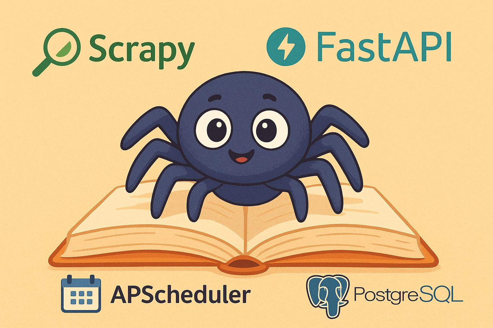
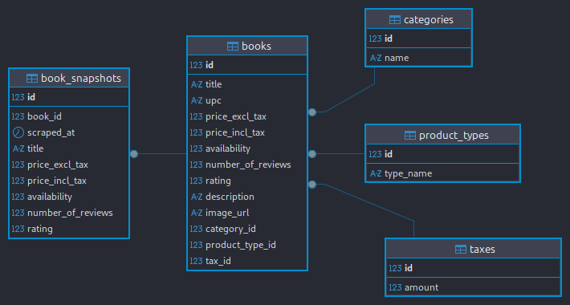

# 📚 scrapy_books_fastapi

[](https://www.python.org/)
[](https://fastapi.tiangolo.com/)
[](https://www.postgresql.org/)
[](https://www.docker.com/)
[](LICENSE)

Une plateforme de **scraping**, de **gestion** et d’**analyse** de livres combinant **Scrapy**, **FastAPI** et **PostgreSQL** via **SQLModel**.

---

## Sommaire

- [📚 scrapy\_books\_fastapi](#-scrapy_books_fastapi)
  - [Sommaire](#sommaire)
  - [Fonctionnalités](#fonctionnalités)
  - [Architecture](#architecture)
  - [Installation](#installation)
    - [1. Créer un environnement virtuel](#1-créer-un-environnement-virtuel)
    - [2. Activer le `.venv`](#2-activer-le-venv)
    - [3. Installer les dépendances](#3-installer-les-dépendances)
  - [Configuration](#configuration)
  - [Lancement](#lancement)
    - [Lancer toute la plateforme](#lancer-toute-la-plateforme)
    - [Lancer uniquement certains services](#lancer-uniquement-certains-services)
      - [Lancer PostgreSQL avec Docker](#lancer-postgresql-avec-docker)
  - [Scraping et planification](#scraping-et-planification)
  - [API FastAPI](#api-fastapi)
    - [Lancer le serveur API](#lancer-le-serveur-api)
    - [Utilisation de l’API](#utilisation-de-lapi)
  - [Base de données](#base-de-données)
    - [Exemple de schéma de la base](#exemple-de-schéma-de-la-base)
  - [](#)
  - [Auteurs et licence](#auteurs-et-licence)

---

## Fonctionnalités

- **Scraping** de livres depuis [books.toscrape.com](https://books.toscrape.com) avec Scrapy.
- **Stockage** des données dans PostgreSQL via SQLModel.
- **API REST** (FastAPI) pour consulter, filtrer et analyser les livres.
- **Planification automatique** du scraping avec APScheduler.
- **Nettoyage et transformation** des données via pipelines Scrapy.
- **Analyses** statistiques sur les livres (prix, catégories, etc.).
- **Configuration centralisée** via `.env` et Azure Key Vault (optionnel).

---

## Architecture

```bash
scrapy_books_fastapi/
│
├── api/                : FastAPI (routes, schémas, CRUD)
├── config/             : Configuration (.env, settings)
├── db/                 : Modèles SQLModel et gestion de la DB
├── scrapy_books/       : Projet Scrapy (spiders, pipelines, scheduler)
├── main.py             : Point d’entrée (initialisation DB, services)
├── runner.py           : Script de lancement (DB + scraping + API)
├── docker-compose.yml  : PostgreSQL via Docker
├── requirements.txt    : Dépendances Python
└── README.md           : Ce fichier
```

---

## Installation

### 1. Créer un environnement virtuel

```sh
python -m venv .venv
```

### 2. Activer le `.venv`

- Linux / macOS :
```sh
source .venv/bin/activate
```

- Windows :
```sh
.venv\Scripts\activate
```

### 3. Installer les dépendances

```sh
pip install -r requirements.txt
```

---

## Configuration

1. Copier l’exemple de fichier `.env` :
```sh
cp .env.example .env
```

2. Modifier les variables si besoin :

- `DB_USER`, `DB_PASSWORD`, `DB_NAME`, `DB_HOST`, `DB_PORT`
- `DOCKER_ON`, `RUN_SCRAPY`, `RUN_API`
- `AZURE_KEY_VAULT_URL` (optionnel)

> **⚠️ Si PostgreSQL est installé en local, ajustez `DB_PORT` pour éviter les conflits avec Docker.**

---

## Lancement

### Lancer toute la plateforme

Si `DOCKER_ON=True` dans `.env` et que Docker est installé, lancez simplement :

```bash
python runner.py
```

> **⚠️ Par défaut, le scraping est planifié toutes les 15 minutes (pour les tests).  
> Vous pouvez modifier l’intervalle dans la fonction `start_scheduler` du fichier  
> [`scrapy_books/scheduler.py`](scrapy_books/scheduler.py) pour le passer en heures ou en jours selon vos besoins.**


Ce script :

- Démarre PostgreSQL (si Docker activé)
- Attend la disponibilité de la base
- Crée les tables via SQLModel
- Lance le scheduler Scrapy (si activé)
- Démarre le serveur FastAPI (si activé)

### Lancer uniquement certains services

#### Lancer PostgreSQL avec Docker

```sh
docker-compose up -d
```

Sinon, assurez-vous que PostgreSQL local est lancé et que `.env` pointe sur la bonne base.

---

## Scraping et planification

- **Spider Scrapy** : [`books.py`](scrapy_books/scrapy_books/spiders/books.py)  
- **Planification automatique** : [`scheduler.py`](scrapy_books/scheduler.py)

Pour lancer le scraping manuellement :

```bash
cd scrapy_books
scrapy crawl books
```

---

## API FastAPI

### Lancer le serveur API

```bash
uvicorn api.main:app --reload
```

L’API sera disponible sur [http://127.0.0.1:8000](http://127.0.0.1:8000)

### Utilisation de l’API

- **Documentation interactive** : [http://127.0.0.1:8000/docs](http://127.0.0.1:8000/docs)
- **Endpoints principaux** :
  - `/books/` : liste, filtrage, recherche de livres
  - `/analytics/` : statistiques (prix moyen, nombre par catégorie, etc.)
  -  `/snapshots/` : gestion et consultation des historiques de scraping
---

## Base de données

- Tables créées automatiquement par SQLModel lors du lancement.
- Pour visualiser les relations et la structure, utilisez un outil comme **DBeaver** ou **pgAdmin**.

> Tables principales : `Book`, `BookSnapshot`,`Category`, etc., avec relations entre livres, catégories et historiques de scraping.

### Exemple de schéma de la base


---

## Auteurs et licence

- Auteur principal : [benjsant](https://github.com/benjsant)
- Licence : MIT ([LICENSE](LICENSE))